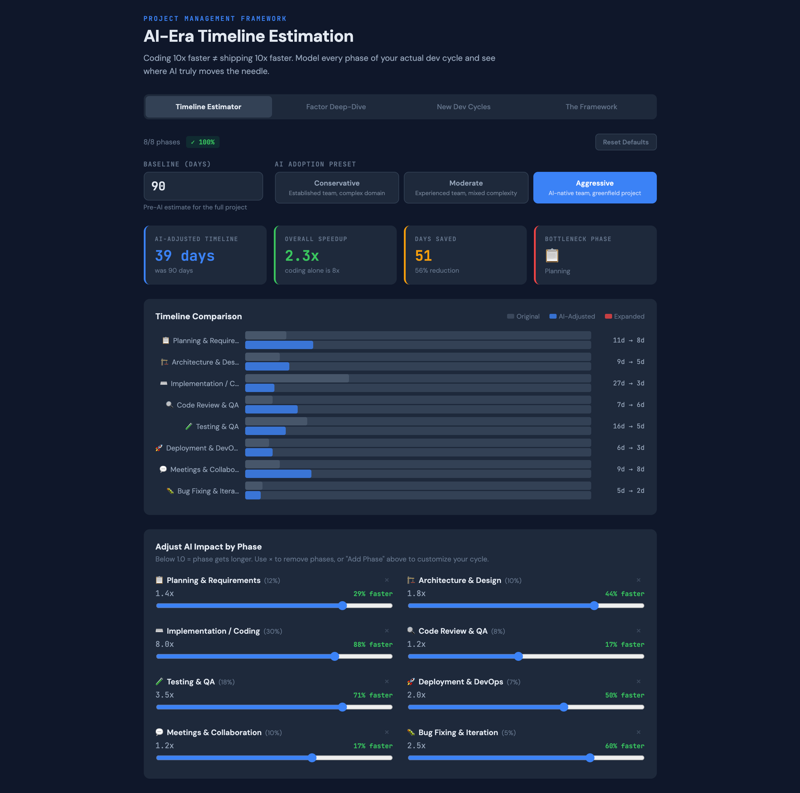

# 10x-illusion

**Coding 10x faster ≠ shipping 10x faster.**

An interactive framework for project managers and tech leads to estimate realistic project timelines in the AI era. Based on the insight that Amdahl's Law applies to software development cycles — even infinite speedup on coding alone is bounded by the phases AI can't accelerate.



## The Problem

AI coding agents are genuinely 5-10x faster at implementation. But teams and stakeholders are making a dangerous estimation error: applying that multiplier to the entire project timeline.

A typical software project looks like this:

| Phase | % of Timeline | AI Speedup |
|-------|:---:|:---:|
| Planning & Requirements | 12% | 1.2x |
| Architecture & Design | 10% | 1.3x |
| **Implementation / Coding** | **30%** | **5-10x** |
| Code Review | 8% | 0.8x (gets *longer*) |
| Testing & QA | 18% | 2.5x |
| Deployment & DevOps | 7% | 1.5x |
| Meetings & Collaboration | 10% | 1.1x |
| Bug Fixing & Iteration | 5% | 1.5x |

With coding at ~30% of the project and AI at 10x speed on that slice:

```
Speedup = 1 / [0.70 + 0.30/10] = 1 / 0.73 = 1.37x
```

**That's a 37% improvement — not 10x.** And some phases (like code review) actually get *longer* because there's more AI-generated code to review.

## What This Tool Does

### 🧮 Timeline Estimator
Plug in your baseline estimate, adjust per-phase AI multipliers, and see the realistic project timeline. Switch between Conservative, Moderate, and Aggressive presets to present stakeholders with a range.

### 🔍 Factor Deep-Dive
Explore each phase's AI impact, human bottleneck, and new risks introduced by AI tooling. Understand *why* each multiplier is what it is.

### ♻️ New Dev Cycles
Three proposed development methodologies designed for AI-augmented teams:
- **Spec-First Rapid Iteration** — front-load specifications, let AI execute
- **Generate → Review → Refine** — AI drafts multiple approaches, humans curate
- **Continuous Human-AI Pairing** — real-time collaboration, no handoffs

### 📐 The Framework
The conceptual foundation: Amdahl's Law applied to SDLC, five estimation principles, step-by-step usage guide, and a role-shift matrix showing how PM/dev/QA roles evolve.

### ✏️ Customizable Phases
Add, remove, and configure up to 8 development phases to match your actual workflow. Track whether your percentages sum to 100%. Custom phases get full AI multiplier ranges, bottleneck analysis, and risk assessment.

## Quick Start

```bash
# Clone the repo
git clone https://github.com/mpklu/10x-illusion.git
cd 10x-illusion

# Install dependencies
npm install

# Start development server
npm run dev
```

Open [http://localhost:5173](http://localhost:5173) to see the framework.

## Tech Stack

- **React** — UI components
- **Vite** — Build tooling
- **No external UI libraries** — zero dependency bloat, pure CSS-in-JS

## The Five Estimation Principles

1. **Decompose before you multiply** — Apply AI multipliers per-phase, not as a blanket factor.
2. **Account for expanding phases** — More AI code → more review, more testing. Some phases get longer.
3. **Specification becomes the bottleneck** — AI is fast but literal. Poor specs produce fast garbage.
4. **Plan for the review funnel** — Senior devs can't review faster just because AI writes faster.
5. **Use ranges, not points** — Always present conservative/moderate/aggressive scenarios.

## Roadmap

- [ ] Export estimates as PDF/CSV for stakeholder presentations
- [ ] Sprint retrospective mode — input actuals, auto-calibrate multipliers
- [ ] Team AI maturity assessment questionnaire
- [ ] Integration with project management tools (Jira, Linear, etc.)
- [ ] Historical data tracking across projects
- [ ] Multi-team / multi-project portfolio view

## Contributing

Contributions welcome! Whether you're a PM with real-world calibration data, a dev lead with insights on AI-augmented workflows, or a designer who can make this more beautiful — open a PR or issue.

## License

MIT License — see [LICENSE](./LICENSE) for details.


